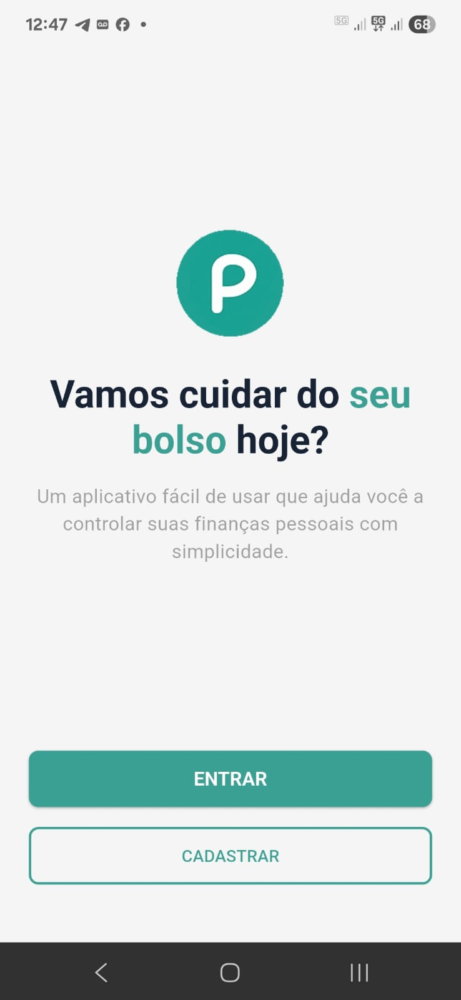
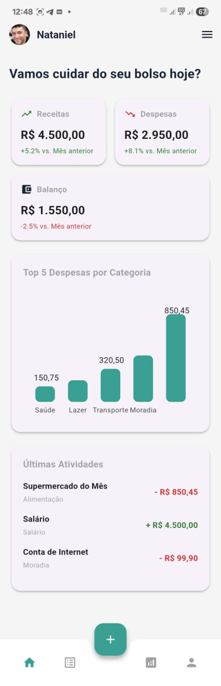

# Poupaí 🐷


**Seu bolso sob controle. Simples, rápido e no seu bolso.**

---

## 📋 Sobre o Projeto

O **Poupaí** é um aplicativo de gestão de finanças pessoais, desenvolvido em Flutter, com um design simples e moderno. O objetivo é ajudar o usuário a controlar despesas, organizar orçamentos e alcançar seus objetivos financeiros sem complicação.

Este repositório contém o código-fonte do aplicativo mobile (Flutter). O back-end que serve a API para este app é desenvolvido em Laravel e está em um repositório separado.

### 📸 Screenshots

|                 Tela de Boas-Vindas                  |           Tela Principal (Dashboard)            |
| :--------------------------------------------------: | :---------------------------------------------: |
|  |  |

---

## ✨ Funcionalidades (MVP)

* **Autenticação de Usuário:** Cadastro e login seguros.
* **Registro de Transações:** Adição fácil de receitas e despesas.
* **Categorização:** Organização automática das transações em categorias.
* **Dashboard Visual:** Resumo financeiro com métricas e gráficos.
    * Cards de Receitas, Despesas e Balanço.
    * Gráfico de barras horizontais com o Top 5 de despesas.
    * Lista com as últimas transações.
* **Navegação Intuitiva:** Menu lateral (`Drawer`) para acesso rápido às funcionalidades.
* **Logout Seguro:** Encerramento da sessão do usuário.

---

## 🛠️ Tecnologias Utilizadas

Este projeto foi construído utilizando as seguintes tecnologias:

* **Framework:** [Flutter](https://flutter.dev/)
* **Linguagem:** [Dart](https://dart.dev/)
* **Gestão de Estado:** [Provider](https://pub.dev/packages/provider)
* **Requisições HTTP:** [Dio](https://pub.dev/packages/dio)
* **Armazenamento Seguro:** [Flutter Secure Storage](https://pub.dev/packages/flutter_secure_storage)
* **Gráficos:** [Smart HBar Chart](https://pub.dev/packages/smart_hbar_chart)
* **Variáveis de Ambiente:** [Flutter DotEnv](https://pub.dev/packages/flutter_dotenv)
* **Formatação:** [Intl](https://pub.dev/packages/intl)
* **Links Externos:** https://play.google.com/store/apps/details?id=com.nkart.launcher&hl=en(https://pub.dev/packages/url_launcher)

---

## 🚀 Começando

Siga estas instruções para configurar e executar o projeto em sua máquina local.

### Pré-requisitos

Você precisa ter o Flutter SDK instalado e configurado em seu ambiente. Para verificar, rode:
```bash
flutter doctor
```

### Instalação

1.  **Clone o repositório:**
    ```bash
    git clone [LINK PARA O REPOSITÓRIO DO PROJETO]
    cd poupai_mobile
    ```

2.  **Configure as Variáveis de Ambiente:**
    Este projeto usa arquivos `.env` para gerenciar as configurações da API.
    * Copie o arquivo de exemplo `example.env` e renomeie a cópia para `.env.development`.
        ```bash
        cp example.env .env.development
        ```
    * Abra o arquivo `.env.development` e preencha a variável `BASE_URL` com o endereço da sua API local.

3.  **Instale as dependências:**
    ```bash
    flutter pub get
    ```

---

## ▶️ Executando a Aplicação

Para executar o aplicativo em modo de desenvolvimento, utilize o seguinte comando. A flag `--dart-define` é **essencial** para que o arquivo `.env.development` seja carregado corretamente.

```bash
flutter run --dart-define=ENVIRONMENT=development
```

---

## 📂 Estrutura do Projeto

O código-fonte do aplicativo está localizado na pasta `lib/` e segue uma estrutura organizada por funcionalidade/tipo:

```
lib/
├── config/         # Arquivos de configuração (cores, endpoints da API)
├── models/         # Modelos de dados (ex: UserModel)
├── providers/      # Gerenciadores de estado (ex: AuthProvider)
├── screens/        # Widgets que representam as telas completas do app
├── services/       # Lógica de comunicação com a API (ex: AuthService)
└── widgets/        # Widgets reutilizáveis (botões, cards, etc.)
```